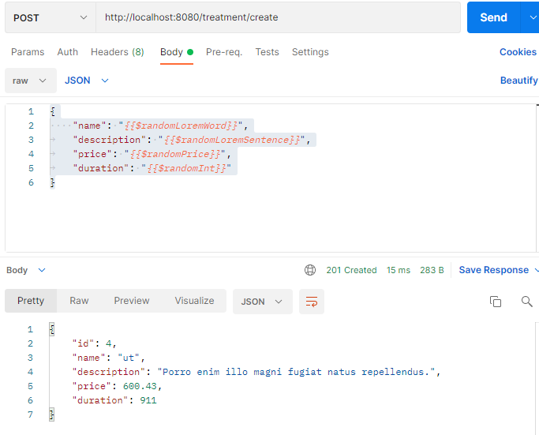

# GZ-Aesthetics

Why are we doing this? 
To practice the knowlage we got during the course.

How I expected the challenge to go.
I was expected that chalange will be team work when everyone has his own task, and after via github we marge to gether all in one, and got final rezukt as a team.

What went well? / What didn't go as planned? 
Sometimes it is very hard to find error a specially if it is speling problem.

Possible improvements for future revisions of the project
I planing convert it to working web page in next 4 month.

Screenshots showing your postman requests and the output from the API.

