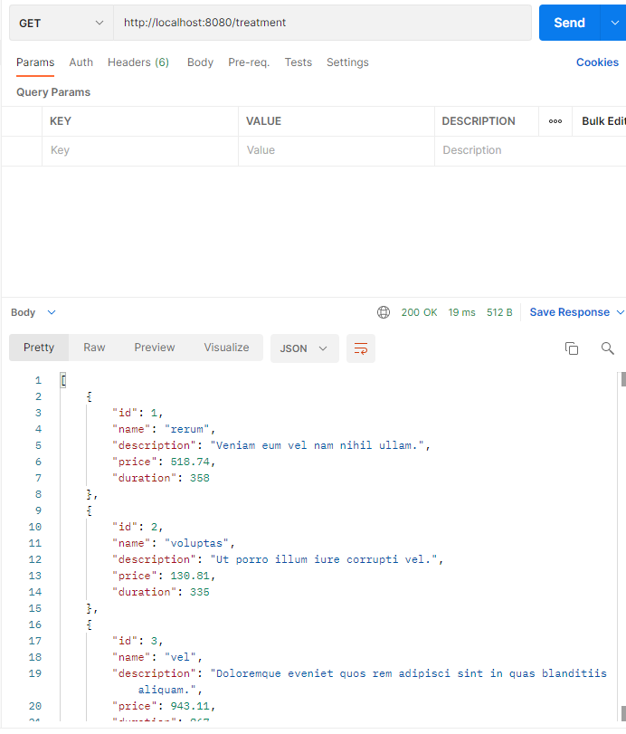
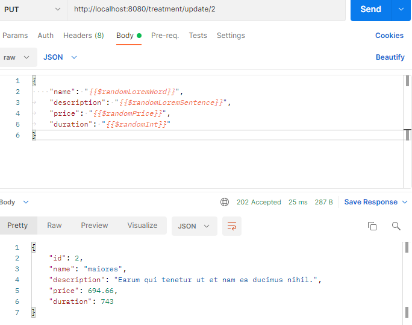
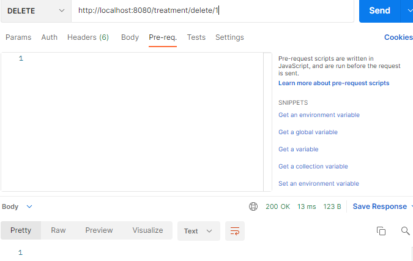
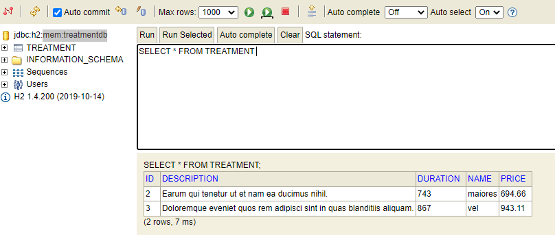
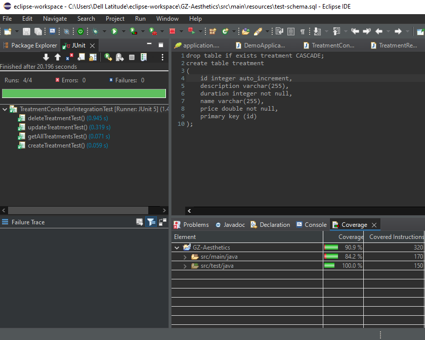

# GZ-Aesthetics

Why are we doing this? 
To practice the knowlage we got during the course.

How I expected the challenge to go. 
I was expected that challenge will be team work when everyone has his own task, and after via GitHub we marge to gather all in one, and got final result as a team. 

What went well? / What didn't go as planned?  
Sometimes it is very hard to find error a specially if it is spelling problem. 

Possible improvements for future revisions of the project 
I planing convert it to working web page in next 4 month.

Screenshots showing your postman requests and the output from the API.
 

 

 

 

Screenshots of your database to prove that data is being persisted. 

Screenshot of your test results, including coverage report.  

Link to Jira Board - You must add Richard as collaborators on your Jira board. 
<a href="https://gz-aesthetics.atlassian.net/jira/software/projects/GE/boards/1">link to Jira Board</a>

